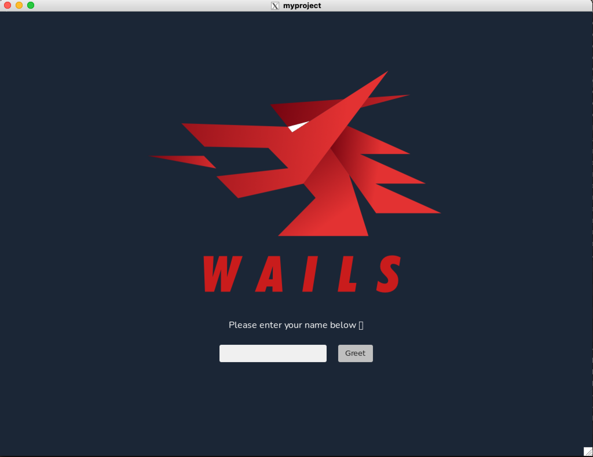

# Wails Docker Development Environment 

Click [here](https://wails.io/) for more information about Wails. 

## Requirements
- [Docker](https://docs.docker.com/get-docker/)
- [VSCode](https://code.visualstudio.com/download)
    - [Dev Containers Extension](https://marketplace.visualstudio.com/items?itemName=ms-vscode-remote.remote-containers)
- [XQuarts (macOS only)](https://www.xquartz.org/)

## Usage

Open using a dev container and try it in terminal:
```bash
cd myproject

wails dev
```


The *myproject* folder is only for test proposes, you can remove if you want.


### Disclaimer
Only tested in macOS 13.1 (22C65)